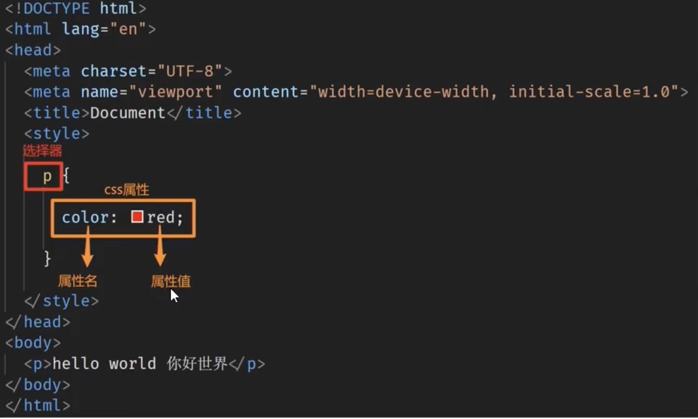

# 01_CSS学习
>CSS（Cascading style sheets）：层叠样式表
---
### 1. CSS的使用
- css写在style标签中，style标签一般写在head标签里面，title标签下面
  
>style标签虽然可以写在页面任意位置，但是通常约定写在 head 标签中

### 2. CSS三种引用方法

  
  1. 内嵌式
   见上
  2. 外联式
  ```html
  <head>
    ...
    <title></title>
    <link rel="stylesheet" href="./001.css">
  </head>
  ```
  3. html
   ```html
    <body?>
    <p style:"color:green">我也是一个p标签</p>
    </body>
  ```