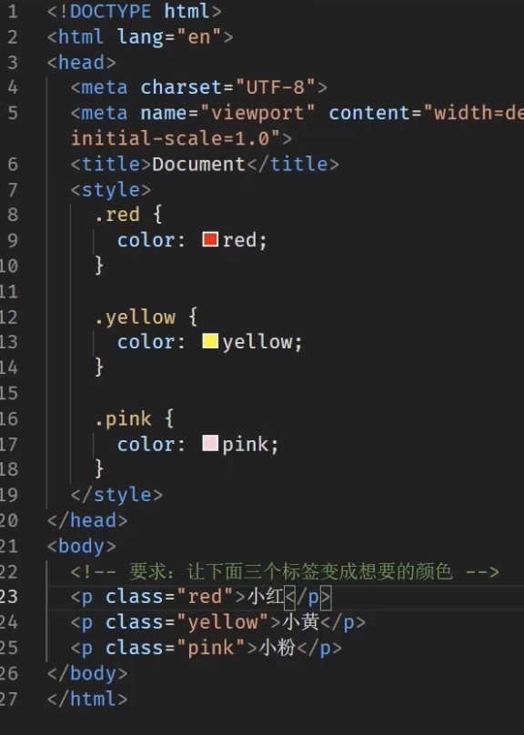

# 02_选择器
---
### 1. 标签选择器
```html
p{
    color:red;
}
```
通过标签名，找到页面中所有这类标签，设置样式

### 2. 类选择器
  
  >注意点：
    1. 所有标签上都有class属性，class属性的属性值称为类名（类似于名字）
    2. 类名可以由数字、字母、下划线、中划线组成，但不能以数字或者中划线开头
    3. 一个标签可以同时有多个类名，类名之间以空格隔开
    4. 类名可以重复，一个类选择器可以同时选中多个标签


### 3. ID选择器
  
    
  >注意点：
    1. 所有标签上都有id属性
    2. id属性個类似于身份证号码，在一个页面中是唯一的，不可重复的！
    3. 一个标签上只能与一个id属性值
    4. 一个id选择器只能选中一个标签
   
### 4. 通配符选择器

找到页面中所有的标签，设置样式
  ```html
    *{
        color:red;
    }
  ```
>可能会用于去除标签默认的margin和padding