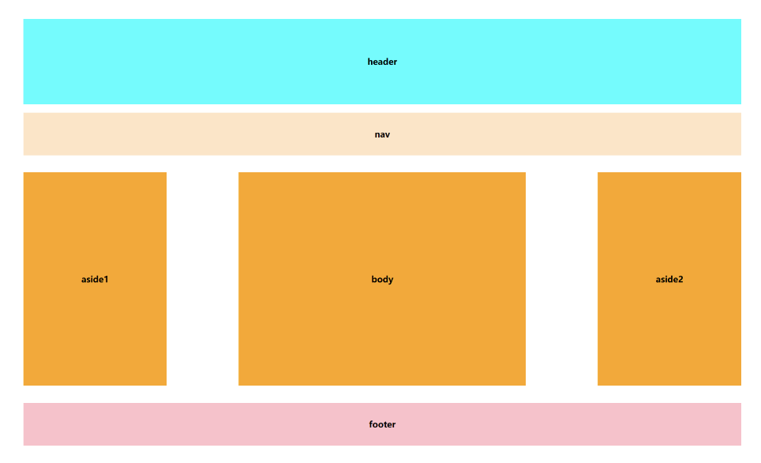

# 前端：阿里巴巴矢量库复刻计划
>用于云屋面试

---

## 已学习进度

- 完成了页面的基础排版（见```Code_for_Study/html+css```文件夹）



1. **git**
   - 注册、建仓、更新仓库、版本管理、克隆仓库
   - 在vscode中操作github仓库
   
2. **markdown**
   - 基础使用、pdf输出、嵌入图片、表格
   - latex公式
   
3. **html**
   - 基础文字标签、表格、媒体标签
   - 表单标签
   
4. **css**
   - html+css实现页面的基础排版
  
5. **JavaScript**


